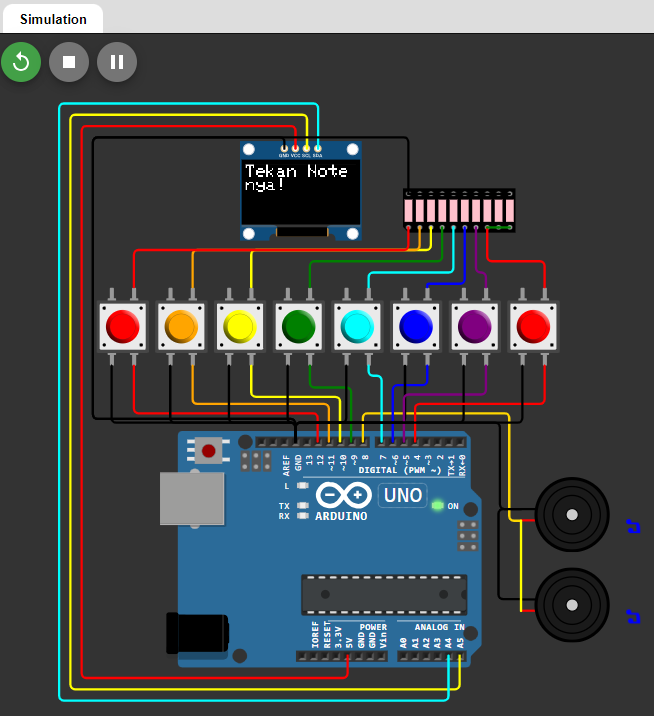

---

# 🎹 Mini Piano dengan OLED Display  
Proyek **Mini Piano** adalah sebuah tugas informatika Pak Sion Thutu Satrio Santoso, S.Kom dari **SMA NEGERI 1 PATI**. Rangkaian proyek ini dibuat menggunakan simulator arduino [wokwi.com]. Proyek ini menggunakan **Arduino Uno**, tombol, buzzer, dan layar **OLED 128x64** untuk menciptakan sebuah mini piano sederhana yang dapat menampilkan nada pada layar OLED saat tombol ditekan.

---

## ✨ **Fitur**  
- **Nada Musik**: Memainkan 8 nada (C4 hingga C5) menggunakan buzzer.  
- **Display Nada**: Menampilkan notasi musik (contoh: C4, D4) pada layar OLED 128x64.  
- **Interaktif**: Nyala tombol sesuai dengan nada yang ditekan.

---

## 🛠 **Komponen yang Dibutuhkan**  
1. **Arduino Uno** x 1  
2. **Push Button** x 8  
3. **OLED Display 128x64 (I2C)** x 1  
4. **Buzzer Aktif/Passive** x 1  
5. Resistor **220 ohm** x 8 (opsional untuk tombol)  
6. Kabel jumper  
7. Breadboard  

---

## 🔌 **Diagram Koneksi**  
Berikut adalah koneksi utama:  
- **Push Button**:
  - Pin tombol: Digital 4-12 (satu tombol ke satu pin).
  - Sisi lain tombol: GND.  
- **OLED Display**:
  - **VCC** → 5V  
  - **GND** → GND  
  - **SCL** → A5  
  - **SDA** → A4  
- **Buzzer**:
  - **Positif** → Digital pin 8  
  - **Negatif** → GND  

**Diagram wiring lengkap tersedia di file `Picture1.png` dalam repositori ini.**  

---

## 📂 **Struktur File**  
```
Mini-Piano/
├── MiniPiano.ino        # File kode utama untuk Arduino
├── README.md            # Dokumentasi proyek
├── diagram.png          # Diagram wiring
└── libraries/           # Folder untuk library tambahan
```

---

## ⚙️ **Instalasi dan Cara Penggunaan**  
1. **Persiapkan Arduino IDE**:  
   - Unduh dan instal **Arduino IDE**.  
   - Instal library berikut melalui **Library Manager**:  
     - Adafruit GFX  
     - Adafruit SSD1306  

2. **Upload Program**:  
   - Buka file `MiniPiano.ino` di Arduino IDE.  
   - Sambungkan Arduino Uno ke komputer.  
   - Upload kode ke Arduino.  

3. **Rakit Rangkaian**:  
   - Susun rangkaian sesuai dengan diagram koneksi.  

4. **Pengoperasian**:  
   - Tekan tombol untuk memainkan nada dan melihat nama not pada OLED.

---

## 🖥 **Demo Proyek**  
Berikut adalah tampilan proyek saat dijalankan:  

### Nada Tertampil di OLED:  
```
Note: C4  
```  

### Wiring Rangkaian:  
  

---

## 📚 **Tentang Proyek**  
- **Nama Proyek**: Mini Piano dengan OLED  
- **Dibuat Oleh**: Ahmad Fajril Falah  
- **Sekolah**: SMA NEGERI 1 PATI  
- **Mata Pelajaran**: Informatika
- **Guru Pengampu**: Pak Sion Thutu Satrio Santoso, S.Kom 

Proyek ini bertujuan untuk mempraktikkan penggunaan Arduino dalam aplikasi musik sederhana, dengan integrasi tampilan interaktif menggunakan OLED.

---

## 🤝 **Kontribusi**  
Kontribusi selalu diterima! Jika Anda ingin menambahkan fitur baru atau memperbaiki bug, silakan kirimkan pull request atau buka issue di repositori ini.

---

Jika ada hal yang perlu diperbaiki atau ditambahkan, beri tahu saya! 😊
